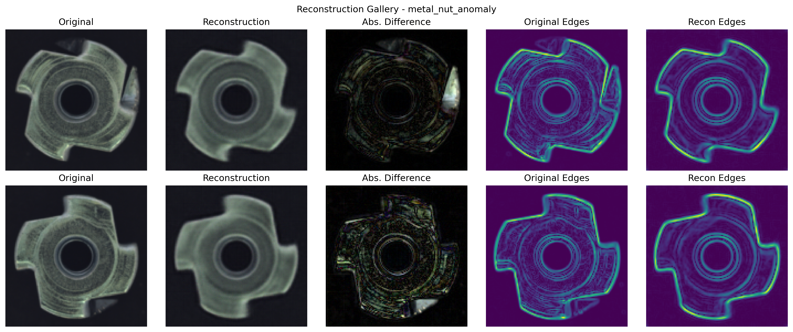

# CompViVAEAD: Geometric-Prior VAEs for Industrial Anomaly Detection

[](https://www.python.org/)
[](https://pytorch.org/)
[](LICENSE)

A deep learning framework for unsupervised anomaly detection in industrial images using Variational Autoencoders with geometric edge priors. This project implements both standard VAEs and improved VAEs with geometric loss for better detection of structural defects in the MVTec AD dataset.

<p align="center">
  
</p>

## Features

- **Baseline VAE**: Standard VAE implementation for anomaly detection
- **Improved VAE with Geometric Prior**: Novel approach for enhancing edge preservation during reconstruction
- **Extensive Hyperparameter Analysis**: β-sweep, λ-sweep, and batch-size sensitivity studies
- **Modular Architecture**: Easily extensible for new models and datasets
- **Comprehensive Visualization**: Tools for qualitative and quantitative performance analysis
- **Synthetic Data Generation**: Scripts to create synthetic defects for model validation

## Installation

```bash
# Clone the repository
git clone https://github.com/yourusername/CompViVAEAD.git
cd CompViVAEAD

# Install dependencies
pip install -r requirements.txt

# Download preprocessed dataset
# (or use the provided link in the Dataset section)
```

## Dataset

The project uses the MVTec AD dataset, preprocessed for ease of use:
- Images normalized to [0,1] range
- Resized to 128×128 pixels
- Stored in H5PY format

**Download processed dataset**: [HeiBox Link](https://heibox.uni-heidelberg.de/d/82f8dc366d504a49b989/)

## Usage

### Training Models

```bash
# Train baseline VAE
python src/training/train_baseline.py --class_name metal_nut --epochs 50 --batch_size 16 --seed 42 --beta 0.05

# Train improved VAE with geometric prior
python src/training/train_improved.py --class_name metal_nut --epochs 50 --batch_size 16 --seed 42 --beta 0.05 --lambda_geo 0.1
```

### Evaluation

```bash
# Evaluate a trained model
python src/evaluation/evaluate.py --exp_dir experiments/metal_nut/baseline/metal_nut_baseline_beta0.05_lr1e-3_seed42
```

### Visualization

```bash
# Generate all visualizations for a model
python -c "from src.evaluation.visualization import generate_all_visualizations; generate_all_visualizations()"
```

### Synthetic Data Generation

```bash
# Generate synthetic defects for training validation
python src/scripts/generate_synthetic_data.py --class_name metal_nut --defect_type scratches
```

## Project Structure

```
CompViVAEAD/
├── data/                 # Dataset files and synthetic defect images
├── experiments/          # Training output directories organized by class/model
├── models/               # Saved model weights
├── notebooks/            # Jupyter notebooks for exploration and analysis
├── reports/              # Generated figures and analysis reports
└── src/                  # Source code
    ├── config.py         # Configuration parameters
    ├── data_loader.py    # Dataset loading utilities
    ├── evaluation/       # Evaluation and visualization modules
    ├── models/           # Model architectures (vanilla and improved VAEs)
    ├── scripts/          # Utility scripts
    ├── training/         # Training loops and loss functions
    └── utils/            # Helper functions
```

## Key Components

- **data_loader.py**: Loads the MVTec dataset from H5PY format
- **models/vanilla_vae.py**: Baseline VAE implementation
- **models/improved_vae.py**: VAE with geometric edge prior
- **training/losses.py**: Custom loss functions including geometric edge loss
- **evaluation/evaluate.py**: Quantitative model evaluation
- **evaluation/visualization.py**: Visualization tools for model analysis
- **utils/synthetic_defects.py**: Synthetic defect generation

## Results

Our experiments demonstrate that:
1. Proper loss normalization (per-sample sum then mean) significantly improves anomaly detection performance
2. The geometric edge prior enhances detection of structural defects in industrial parts
3. Different hyperparameters (β, λ_geo) have significant effects on model performance

## License

This project is licensed under the MIT License - see the LICENSE file for details.

## Acknowledgements

- [MVTec AD Dataset](https://www.mvtec.com/company/research/datasets/mvtec-ad)
- Computer Vision course at University of Heidelberg
